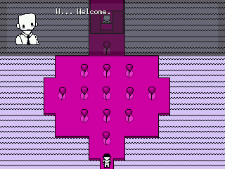
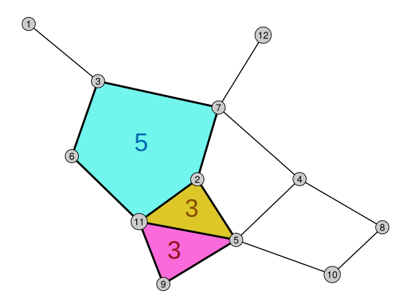
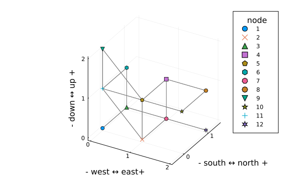
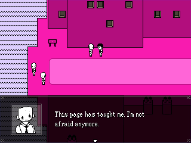

# this dungeon is accessible

## motivation

I was *going* to write about the [combinatorics](https://en.wikipedia.org/wiki/Combinatorics), [game theory](https://en.wikipedia.org/wiki/Game_theory), and graph theory behind "Balloon Game" in Zone 2 of the video game [*OFF*, by Mortis Ghost](https://en.wikipedia.org/wiki/Off_(video_game)). "Balloon Game" being a very simple [minigame](https://en.wikipedia.org/wiki/Minigame), I thought it a delightful example to showcase some math.



I wrote a good bit of my article and finally got to diagramming how the game plays out, using the popular [Mermaid](https://mermaid.js.org/) diagramming tool. The diagram—a network of information known as a [game tree](https://en.wikipedia.org/wiki/Game_tree)—represented each state in the game as a point, or [node](https://en.wikipedia.org/wiki/Vertex_(graph_theory)). Each decision a player could take was a connection, or [edge](https://en.wikipedia.org/wiki/Glossary_of_graph_theory#edge), between appropriate nodes. For example: the node "player 1 has ten balloons" was connected, through the edge "player 1 pops three balloons," to the node "player 2 has seven balloons." All possible states and decisions considered, the tree's structure was complex; it had twelve nodes, sixteen edges, and lots of [interlinking](https://en.wikipedia.org/wiki/Vertex_connectivity).

, as well as edge directions (see [note](#notes) 1), have been removed. The tree's nodes are instead labeled numerically, and its edges are unlabeled.")

Then, I began to wonder. *How do I even begin to describe this image in text?*

I don't intend to limit my blog to readers with un[impaired vision](https://en.wikipedia.org/wiki/Visual_impairment), zero [learning disabilities](https://en.wikipedia.org/wiki/Learning_disability), and high-speed internet. All those people and more rely on text to navigate the web: people who rely on [screen readers](https://en.wikipedia.org/wiki/Screen_reader), people who have trouble tracking complex visuals, and people who simply [can't afford to download multimedia](https://100r.co/site/internet.html). If I'm not providing [alternative text](https://www.w3.org/WAI/WCAG22/Understanding/non-text-content) (alt text) alongside my images, then for those readers, my message is lost. To include text-based users in my dialogue, I would need to find a completely new way to illustrate my tree.

## graphs

A [tree](https://en.wikipedia.org/wiki/Tree_(graph_theory)), like the one I attempted to write about, is a special case of a more general, mathematical structure: a [*graph*](https://en.wikipedia.org/wiki/Graph_(discrete_mathematics)). This use of the term *graph* is not something like an $x$-versus-$y$ plot; a graph, in this context, is a collection of abstract objects with connections between them.

> [Graph theory](https://en.wikipedia.org/wiki/Graph_theory)—the academic discipline that surrounds graphs—is relatively young on the timescale of humans-doing-math, and so its terminology varies. I call the objects in a graph *nodes*, and the connections between them *edges*. In other literature, these may respectively be called *vertices* and *arcs*; I avoid these terms, for consistency.

Citizens of [Königsberg](https://en.wikipedia.org/wiki/K%C3%B6nigsberg), Prussia, wondered if they could walk through every island in the city while crossing each of the city's seven bridges exactly once; [Leonhard Euler](https://en.wikipedia.org/wiki/Leonhard_Euler) [proved](https://www.cantab.net/users/michael.behrend/repubs/maze_maths/pages/euler_en.html) the [Seven Bridges of Königsberg](https://en.wikipedia.org/wiki/Seven_Bridges_of_K%C3%B6nigsberg) problem impossible in 1735, only by leveraging metaphors that would become the basis of graph theory.

, [CC BY-SA 4.0](https://creativecommons.org/licenses/by-sa/4.0/).")

Whether or not we call them *graphs*, networks of information are everywhere: bridged islands, flowcharts, metro maps, or what have you. The ability to clearly represent, or [draw](https://en.wikipedia.org/wiki/Graph_drawing), those networks is what allows for analysis and problem-solving. Graph drawing methods are diverse; flowcharts rely on well-placed, geometric shapes at nodes while metro maps keep edges of rail between stations at near-45° angles. Based upon their use cases, graph drawings are governed by rules that:

1. support the [semantics](https://en.wikipedia.org/wiki/Semantics), or structures of meaning, that they aim to communicate
2. and respect the [media](https://en.wikipedia.org/wiki/Means_of_communication), like zoomable screens or paper posters, that they lie in.

*Euler himself lost his sight by 1766, and that didn't stop him.*

## gap

[Mermaid advertises itself](https://mermaid.js.org/) as a way to use "easy-to-write text definitions to create and modify diagrams dynamically." In practice, these "text definitions" are lists of data conveniently designed to look like human language.

```
graph LR
    1[player 1 has ten balloons]
    --"player 1 pops three balloons"-->
    2[player 2 has seven balloons]
```

For graphs: Mermaid algorithmically organizes the defined nodes and edges (and their respective labels) to lay them out neatly and intuitively in 2D.


Small graphs like this one—a mere three elements—are easy enough to describe manually. If screen readers weren't so [sensitive to punctuation](https://www.w3.org/WAI/WCAG2/supplemental/patterns/o3p06-format-punctuation/), the Mermaid code itself might've sufficed! Graphs [scale quickly](https://math.stackexchange.com/a/2293671), though; an average, simple graph with $n$ nodes has on the order of $n^2$ elements. Listing them all out would quickly overwhelm a reader—especially if a screen reader were parroting them, one by one, in its robotic voice. Further: a list with a predetermined order wouldn't capture most graphs' complex, unordered structures of connections. *I'm sure I can do better than a list.*

I searched Mermaid's documentation and didn't find much more than notes on [adding special titles and descriptions for text-based users](https://mermaid.ai/open-source/config/accessibility.html)—an answer to *where* to put alt text, but not an answer to *how* to construct a meaningful textual experience from so much info. I eventually found an [open issue](https://github.com/mermaid-js/mermaid/issues/5632) within the Mermaid community, set out in July of 2024. Mermaid contributor [Ian Sanders writes](https://github.com/mermaid-js/mermaid/issues/5632#issue-2396427498):

> Current support for accessibility is limited to [three optional description fields... These] are rarely set and have to be manually built by the consumer, meaning that all information in the diagram has to be duplicated into the description.
> 
> The diagram content itself is wholly inaccessible to screen readers — it typically presents as near-nonsense. This is a shame as it means that nonsighted users cannot share in the rich diagramming experience that sighted users have access to. Mermaid diagrams can contain information that is critical to understanding the page they are on, so that information being inaccessible can sometimes make the entire page inaccessible.

*Rats.*

## contribution

*What might an alternate, text-based view of a graph look like?* From *OFF*, my mind hopped to another game: [*The Dreamhold*, by Andrew Plotkin](https://zarfhome.com/dreamhold/). *The Dreamhold* introduced me to the interactive fiction (IF) genre (though I do still need to finish the game...). Much like traditional fiction novels, IF is presented entirely through text.

> ### Crowded Study
> You stand amid clutter, oddments, shelves and stacks. The chamber is comfortably broad, centered around a massive and well-worn wooden desk. But so much is jammed in, around the desk and up the panelled walls, that you barely find room to stand.

Players interact with the world in text.

> *> examine the walls*
> 
> The walls are fine panels of some dark wood, framed in a darker wooden lattice.

Players even navigate the story's setting with text-based commands; you might walk between connected rooms of house with "north" and "east", or climb ladders between floors of a treehouse with "up" and "down." Movement is deliberately simplified and predictable so that cognitive effort can be spent on meaning, not orientation.

> There are wide doorways on the north and east sides of the room. A door of heavy wood stands closed to the south, and stairs descend into dimness to the west.
> 
> *> north*
> 
> ### Sitting Room
> This room seems more inviting.

IF doesn't just rely on terse directions like "east" and "west" out of tradition. In keeping movement descriptions short—placing everything on rectangular grid, or [rectilinearly](https://en.wikipedia.org/wiki/Regular_grid#Rectilinear_grid)—storytellers can yield center stage to richer descriptions in the rest of their work. For storytellers looking to convey complex narratives, that predictiability is key; for technical communicators looking to depict complex graphs, it's a compelling lead.

*What if we made graph drawings like that, too?* If each node were a room, and each edge a doorway, ladder, or stairwell, then a graph could be explored spatially through text alone. Given a suitable layout, or [embedding](https://en.wikipedia.org/wiki/Graph_embedding), we could turn arbitrary graphs into navigable, textual spaces.

And so, we build a dungeon. 

## approach, part one: organizing graphs for interaction

Applying the IF metaphor to just *any* old graph introduces challenges. Graphs are just collections of nodes and edges, and don't (generally) say anything about where those nodes and edges should be placed in space. If you placed nodes at random, you'd get a cobweb of overlapping edges; they need to be untangled into a neat, rectilinear layout to get a viable floorplan.

00014-X). An arbitrary graph (a) is given. The graph is planarized (b), its nodes rearranged to eliminate edge crossings. The planarization is orthogonalized (c), edges stretched and bent to lie on a square grid. The orthogonalization is compacted (d), edges shortened and tweaked to minimize spread.")

Laying out graphs subject to constraints quickly becomes difficult. We've all tried untangling a mass of cables; now, imagine that all the cables you untangle need to meet at right angles the moment you set them down. Worse yet: strict requirements that each edge be straight and lie on one of the six rectilinear directions in 3D—the four cardinal and two vertical—greatly limits the number of graphs that can be represented (see [note](#notes) 2). If a graph includes even a single node with more than six edges— [degree](https://en.wikipedia.org/wiki/Degree_(graph_theory)) greater than six—it can't be embedded under these constraints. Many graphs with lower degree *still* can't be embedded rectilinearly, owing to subtler structural issues.

#Chordless_cycle). Despite all nodes having degree two—two connections—there's no way to embed this graph in 2D nor 3D such that all edges are straight and make right angles with each other.")



IF cheats the rectilinear rule all the time; the occasional diagonal hallway, bent corridor, or naturally-diagonal stairwell isn't uncommon.

> You see doorways to the south and **in the southeast corner** of the room.

I decided to compromise just like IF authors do; I would discourage nonrectilinear movement, but not disallow it entirely. *As long as my floorplans don't look like NYC apartments, they'll do.*

<figure class="windowed">
  <video controls class="narrow"><source src="https://web.archive.org/web/20220201112203/https://v16-webapp.tiktok.com/fdd23d3c577d8b57ebc721163a609296/61f96c73/video/tos/useast2a/tos-useast2a-pve-0068/4da9ba78f207434b9392cf0ae9a4a2fa/?a=1988&br=2252&bt=1126&cd=0%7C0%7C1%7C0&ch=0&cr=0&cs=0&cv=1&dr=0&ds=3&er=&ft=XOQ9-3E7nz7Thxnn.lXq&l=2022020111220201022307604206ACE9A4&lr=tiktok_m&mime_type=video_mp4&net=0&pl=0&qs=0&rc=amptbzY6Zm5mNzMzNzczM0ApZDpoZjhmO2Q2NzNlaDs0ZWdmbzJgcjQwZzZgLS1kMTZzczIyMjM0YTItYmFjMzIzYTU6Yw%3D%3D&vl=&vr=" type="video/mp4" /></video>
  <figcaption>An NYC apartment with a funky hallway and just about no right angles. <a href="https://www.tiktok.com/@rentnewyork/video/6994875148151147782">Original video</a> by Levi Pinson, shared <a href="https://web.archive.org/web/20220201112202/https://www.tiktok.com/@rentnewyork/video/6994875148151147782#">via the Wayback Machine</a> for your privacy.</figcaption>
</figure>

### prior art

Embedding arbitrary graphs like this isn't a novel problem, luckily! This problem takes many forms: [turning circuit schematics into physical circuit board designs](https://dl.acm.org/doi/10.5555/1882723.1882731), [laying out real-world floorplans based on usage needs](https://doi.org/10.1007/978-981-10-5197-5_22), and more. [Di Battistia et al., 1994](https://doi.org/10.1016/0925-7721(94)00014-X)—[a real powerhouse quartet of authors in the graph drawing scene](https://dl.acm.org/doi/10.5555/551884)—put together a great annotated bibliography surveying the landscape of research on laying out graphs for informational clarity.

Seeing the lengths of the papers Di Battista et al. cited, though, I began to bargain with myself. *These algorithms came out forty years ago! I'm sure computers have gotten fast enough to negate the need for such well-optimized algorithms.* Had I paid attention, the papers' lengths might've warned me of how difficult this problem is to solve; I nevertheless set aside existing approaches and tried my own.

### optimistic formulation

Rather than implementing a bespoke embedding algorithm, I reached for a tool more familiar to me: [mathematical programming](https://en.wikipedia.org/wiki/Mathematical_optimization) (see [note](#notes) 3 ). I described the embedding problem declaratively—nodes and edges lie on a grid; edges fall into directional categories; nodes and edges don't overlap. Smarter people have already done the [hard work](https://en.wikipedia.org/wiki/List_of_optimization_software#Applications) to implement solvers for mathematical programs like mine.

I solved the model with [HiGHS](https://highs.dev/), [one of the fastest](https://openenergybenchmark.org/) open-source solvers for [mathematical programs like this one](https://en.wikipedia.org/wiki/Integer_programming), running on all sixteen threads of my laptop's CPU. HiGHS' speed, however, was no match for my model. I tested my approach with the "Balloon Game" tree that started this all. *One minute, five, ten, thirty... And still nothing?* It just wouldn't settle, or converge, on an optimal solution.

I should've known—the model was immense. The simple-sounding constraints I laid out were really asking HiGHS to compare the positions of every node with every other node's, every edge with every other edge's. All the common-sense, geometric relationships that we expect of [the physical space we live in](https://en.wikipedia.org/wiki/Euclidean_space), made explicit, amounted to a monstrosity of a program. *Oops.* The "Balloon Game" graph's twelve nodes and sixteen edges had generated tens of thousands of variables and hundreds of thousands of constraint expressions.

*Human intuition sure is expensive.*

### limited results

*I'll accept my fate; I'm not going to get an optimal solution anytime soon. Short of optimality, I really just need something "good enough" to translate to prose.* I stopped HiGHS early and got a workable result for the "Balloon Game" graph. The fact that the solver was stopped before reaching optimality shows; there's a third $z$ level (containing a single node) that doesn't need to be there, and whose flattening onto the level below would have been preferable.



*It's no cookie-cutter, suburban dungeon, but at least we're not in Manhattan.*

## approach, part two: drawing in text

Armed with an acceptable embedding, I had what I needed to turn the "Balloon Game" graph into a textual experience. I opted for the very toolchain many new interactive fiction authors use: I used the [Interactive Fiction Technology Foundation](https://iftechfoundation.org/) (IFTF)'s [graphical editor](https://twinery.org/). I devised a template for node descriptions, and I manually entered each one, connecting nodes as I went.

Though I did this manually, this process was algorithmic, too! The IFTF's graphical editor is really a convenient way to make stories in [Twee](https://twinery.org/cookbook/terms/terms_twee.html) notation—a document format that straddles the line between plain prose and computer code. Given a valid embedding: just a single passage like the one below needs to be added to the document, for each node.

> You're in a room labeled "eleven," on the middle level. There stand two doorways: **north** and **east**. A ladder leads **upward**; a stairwell leads **downward and to the east**.

I opted to make each node a mostly-nondescript room; horizontal edges became doorways, vertical edges became ladders, and diagonal edges became stairwells. For graphs with longer, textual labels: rooms and movement directions could incorporate more detailed descriptions, conveying their original graph's information in ways that build memorable, spatial experiences.

A couple formats of web application were available to me to present the "story;" I had it compiled into a [SugarCube](https://www.motoslave.net/sugarcube/2/) app, as SugarCube is [optimized for screen readers](https://www.reddit.com/r/twinegames/comments/7bedcr/comment/dpjizhl/).

And, at last, I have a [proof of concept](/assets/posts/this-dungeon-is-accessible/dungeon-graph-proof-of-concept.html)! You can navigate the graph interactively by clicking directional links in the text.

<figure class="windowed">
  <iframe
    title="dungeon graph proof of concept"
    width="500"
    height="400"
    src="/assets/posts/this-dungeon-is-accessible/dungeon-graph-proof-of-concept.html"
    loading="lazy">
  </iframe>
</figure>

## discussion

Technically, my concept proves sound. My own blogging intentions revealed a technological gap; we have good tools for specifying graphs—like Mermaid provides—but not for producing alt text that’s as useful as any other graph drawing. I devised a framework for that and demonstrated its feasibility, even when my approach was rough around the edges. In future work, there are a couple things I believe need to happen.

 1. My methods for embedding graphs need to be swapped out for state-of-the-art methods, like those Di Battista et al. point to.
 2. The guidelines for coherently "drawing" graphs in interactive text should be subject to more users' opinions.
 3. Web application formats used to present interactive prose, like SugarCube, need to be investigated further than existing anecdote—specifically to determine whether they're compatible with screen readers. A [static site–based](https://en.wikipedia.org/wiki/Static_site_generator) format may be useful, as pages that use links instead of dynamic content are more reliably compatible with screen readers.

Graph embedding was such a significant point in this article, you'd think it was the end goal. And my approach was horrible! In hindsight, the conceptual issues in my chosen methodology are glaring. Mathematical programming is wonderful for its ability to represent a wide variety of problems through a single framework; it's however unwise to use a machete where a scalpel is due. The constraints that govern valid, graph-in-grid embeddings arise naturally from geometry. In a mathematical program, those constraints *add* complexity, honing a generic modeling tactic to obey expectations. In a well-made algorithm, on the other hand, those constraints are leverage points to *avoid* complexity; if we want to stick to a grid, for example, our algorithm doesn't need the ability to represent non-grid embeddings in the first place. Though approaches like these take more clever strategy (and more time to implement in code), they pay off in efficiency. *Think of my poor, fried CPU.*

Indeed, problems in humanities are difficult to solve; they're squishy, they're subjective, and they rely on human intuitions that resist being quantified. Due to this, it's all too common to see accessibility issues banished to "edge cases," not worth the time and effort to solve when a system's first designed. It's no big deal to dream up a dungeon as an IF author, yet working backward from a generic graph to a dungeon is a serious ask of an engineer. The humanities build up frameworks of thought that computing barely begins to capture, and that computing can learn a whole lot from—especially as contemporaries attempt in vain to [engineer away](https://youtu.be/EUrOxh_0leE) their needs for humanistic work with ill-marketed machine learning tools. Expanding inclusion in intellectual discussions hinges on closely integrating humanities and sciences, and I think our and our peers' quality of life is worth that trouble.



## post

I'm always working on my [science communication](https://en.wikipedia.org/wiki/Science_communication) skills. If you have comments, questions, or ideas: feel free to contact me using the link at the bottom of the page.

## notes

1. By definition, a [tree](https://en.wikipedia.org/wiki/Tree_(graph_theory)) is [acyclic](https://en.wikipedia.org/wiki/Cycle_(graph_theory)); [game trees](https://en.wikipedia.org/wiki/Game_tree) are customarily represented by [directed](https://en.wikipedia.org/wiki/Directed_graph) graphs such that nodes with multiple [walks](https://en.wikipedia.org/wiki/Path_(graph_theory)#Walk,_trail,_and_path) through them can't induce cycles. I nonetheless relax digraphs into simple graphs in this article without too much loss of generality, as directed edges can be interpreted as undirected edges with directional [labels](https://en.wikipedia.org/wiki/Graph_labeling). In future works: specifically addressing edge labels and directionality may be valuable.
2. I intended to cite at least some rough bounds on by how much a restriction to maximum degree six would affect the number of embeddable graphs. The number of [labeled](https://en.wikipedia.org/wiki/Graph_labeling), [simple](https://en.wikipedia.org/wiki/Graph_(discrete_mathematics)#Graph) graphs with a set number of nodes and *minimum* degree is known and documented [in the Online Encyclopedia of Integer Sequences](https://oeis.org/A327366). I don't believe these numbers are known for labeled graphs of a certain *maximum* degree (though they are [documented](https://oeis.org/A263293) for *unlabeled* graphs!), and I'm not deep enough [in the field](https://en.wikipedia.org/wiki/Graph_enumeration#Labeled_vs_unlabeled_problems) to derive bounds myself.
3. I implemented my model with [JuMP](https://jump.dev/), in a [Pluto](https://plutojl.org/) notebook, in the [Julia](https://julialang.org/) programming language. See the (messy) notebook [here](/assets/posts/this-dungeon-is-accessible/notebook.html), or its source code [here](/assets/posts/this-dungeon-is-accessible/notebook.jl).